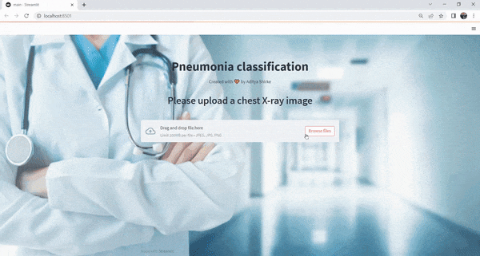
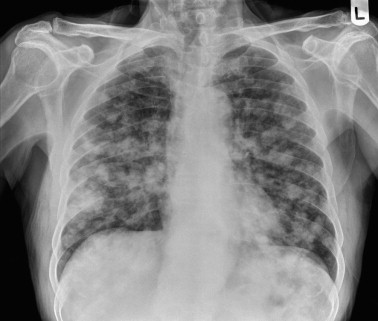
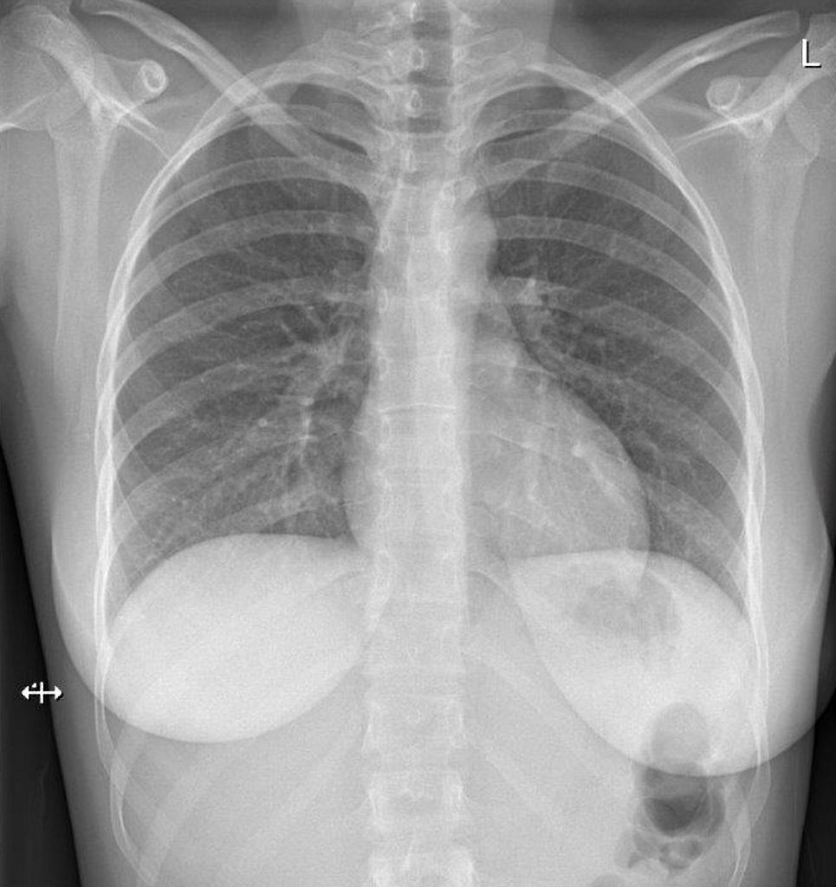

# Pneumonia Classification App

This is a simple web application built with Streamlit that allows you to classify chest X-ray images for pneumonia. It uses a pre-trained deep learning model to make predictions. 

## Getting Started

To run the application locally, follow these steps:

1. Clone the repository or download the code files.
2. Install the required dependencies by running `pip install -r requirements.txt`.
3. Make sure you have the necessary model files in the `model` directory. These include:
    - `pneumonia_classifier.h5`: The trained Keras model for pneumonia classification.
    - `labels.txt`: A text file containing the class names corresponding to the model's output.
4. Set a background image for the application by replacing `bg.jpg` with your desired background image in the `set_background` function call in the `main.py` file.
5. Run the application by executing `streamlit run main.py` in your terminal or command prompt.

## Usage

1. Once the application is running, you will see a title and a header displayed.
2. Please upload a chest X-ray image using the provided file uploader.
3. The uploaded image will be displayed on the screen.
4. The application will automatically classify the image using the pre-trained model.
5. The predicted class name and the confidence score will be shown below the image.

## Difference between Pneumonia and Normal X-rays

### Pneumonia X-ray

Pneumonia X-rays typically show infiltrates, consolidation, or other abnormalities in the lung area. These findings indicate infection and inflammation within the lung tissue.

### Normal X-ray

A normal X-ray will typically show clear lung fields without any significant infiltrates or abnormalities.

## Requirements

The application requires the following dependencies:

- Streamlit
- Keras
- PIL (Python Imaging Library)
- NumPy

You can install the required packages by running `pip install -r requirements.txt`.

## Note

This application is created by Aditya Shirke with ❤️. Feel free to modify and adapt it according to your needs.

**Disclaimer:** This application should not be considered as a substitute for professional medical advice or diagnosis. Always consult a healthcare professional for accurate medical information and guidance.

**Important:** The accuracy of the classification results depends on the quality of the model and the training data. Please ensure that you have a reliable and well-performing model before using it for critical applications.

Enjoy classifying chest X-ray images for pneumonia!
